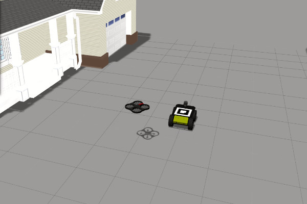

# ardrone_tf_controller
Position controller for landing a Parrot ARDrone using ARToolkit fiducial markers. The UAV model is based on the dedicated gazebo simulator written by Hongrong Huang and Juergen Sturm of the Computer Vision Group at the Technical University of Munich (http://wiki.ros.org/tum_simulator).

## Packages Description

* [teleop_ardrone](teleop_ardrone): Contains the keyboard and space-navigator controller for the ardrone.
* [tum_simulator](tum_simulator): Contains the gazebo world files, the ardrone model with the plugins and the simulation launch files.
* [uga_tum_ardrone](uga_tum_ardrone): Contains a suite for state estimation, autopilot and gui for controlling the ardrone model.
* [ardrone_tf_controller](ardrone_tf_controller): Extract the fiducial marker's pose and forward it to the ardrone model for accomplish autonomous landing.

## Environment

* Operating System
  * [Ubuntu 14.04](http://releases.ubuntu.com/trusty/) - or newer
* Middleware
  * [ROS](http://www.ros.org/) - depending on the installed OS (Indigo, Jade or Kinetic)
* Other Dependencies
  * [GAZEBO](http://gazebosim.org/) - It needs GAZEBO 2 or newer

At any time you might need to install some more specific dependencies (like some missing ROS packages). Please open an issue in case you can't solve these or other dependencies.

## Download and Setup

### 1 - Install ROS
Install ros full desktop following the installation instructions on the official ros website: www.ros.org (tested on indigo, jade and kinetic)

### 2 - Install the ardrone_autonomy package
If you are on Ubuntu simply write on your console:

    $ sudo apt-get install ros-<your-ros-distribution>-ardrone-autonomy

### 3 - Install the ar_pose packages
In order to install the arpose lib follow the instructions in the official repository:
https://github.com/ar-tools/ar_tools

### 4 - Create a catkin workspace
If you don't have it already, create a catkin workspace folder (for more informations look at this link: http://wiki.ros.org/ROS/Tutorials/InstallingandConfiguringROSEnvironment):

    $ mkdir catkin_ws

Create a folder named src inside it:

    $ cd catkin_ws
    $ mkdir src

Run catkin_init_workspace inside the src directory:

    $ cd src
    $ catkin_init_workspace

Now source your new setup.bash file inside your .bashrc:

    $ echo "source <your_catkin_ws_directory>/devel/setup.bash" >> ~/.bashrc
    $ source ~/.bashrc

### 5 - Clone the git repository
Clone the git repository inside your catkin workspace src directory:

    $ cd <your_catkin_ws_directory>/src
    $ git clone https://github.com/pulver22/ardrone_tf_controller.git

## Compile

### 1 - Compile the ros package with catkin
In order to compile the packages just run the following commands:

    $ cd <your_catkin_ws_directory>
    $ catkin_make

## Run
### 1 - Running the simulation with the ardrone only
To launch the simulation with only the ardrone model using roslaunch:

    $ roslaunch single_both_cameras.launch

and then:

    $ roslaunch ardrone_tf_controller autopilot.launch

### 2 - Running the simulation with the ardrone and the Husky
To launch the simulation with both the ardrone and the husky model using roslaunch:

    $ roslaunch cooperative.launch

and then:

    $ roslaunch ardrone_tf_controller coop.launch

## Issues

All kind of issues and contributions will be very welcome. Please get in touch on [our issues page](https://github.com/pulver22/ardrone_tf_controller/issues) when help is needed!
